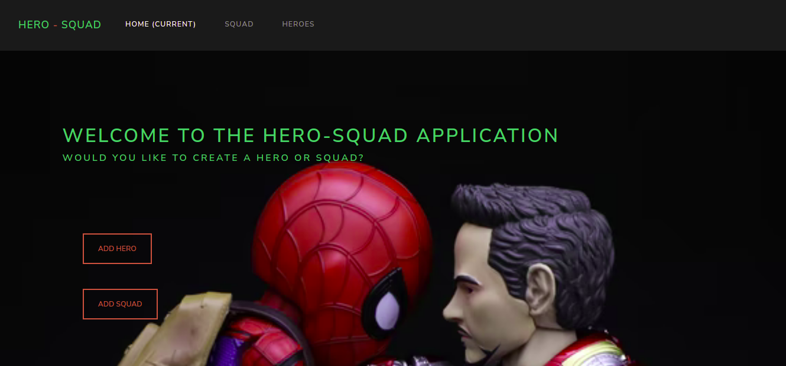

# Hero_Squad

## Author

Peter Njukia

## Demo

### Description

Hero Squad is an application that allows users who interact with it to create heroes and squads that contain a particular number of heroes such as killing squad or intelligence squad. Heroes can be affiliated with only 1 squad at a single time, therefore if the hero was to switch to another group, their name should not be present in the previous squad that they were in.

### Prerequisites

You need to have the following installed on your machine

1. Java JDK
2. Gradle
3. JDK
4. Maven
5. Java IDE (Intellij)

### Setup and Installation

To access this project on your local files, you can clone it using these steps

1. Open your terminal
2. Use this command to clone `$ git clone
   https://github.com/chunuz/Hero_Squad.git
3. This will clone the repository into your local folder
4. Navigate to the folder you cloned into, within src/main/java/App. java and open it with intellij.
5. Go to your browser and type localhost:4567

### Contribution
You may also want to contribute to enhance a functionality:

1. Fork the repository to your GitHub account
2. Create a new branch (git switch -c ft-development)
3. Make the changes you intend
4. Add changes to reflect the changes made
5. Commit your changes (git commit -m 'additional info')
6. Push to the branch (git push origin ft-develop)
7. Create a Pull Request.

### Behavior Driven Development
The user is able to;
1. Run the App on a browser
2. Select the Add Hero or Squad tab which will open a form to fill in the data
3. View the Hero or Squad details.
4. Add more squads and Heroes as possible
(It also allows a user to Test the output before actual running of the App)

### Running Tests
1. Navigate to the folder you cloned into, within src/test/java/models and open it with intellij. Select the HeroTests or SquadTests.

2. This is a sample test to check a correct instance of the Hero object.

@Test 

public void all_hasAllProperties_true() {
      
Hero hero = new Hero ("BatMan", "40", "flying", "water");
       
assertEquals(true, hero instanceof Hero);
   
}

3. Right click within the open test file and run the tests on your terminal.

### Technologies Used

1. HTML
2. CSS
3. Handlebars
4. Java
5. Gradle
6. Spark
7. Junit

### Live Site

[Live Link]

### License

This project is under the [MIT](LICENSE) licence

### Copyright

Copyright (c) 2023 Peter Njukia
